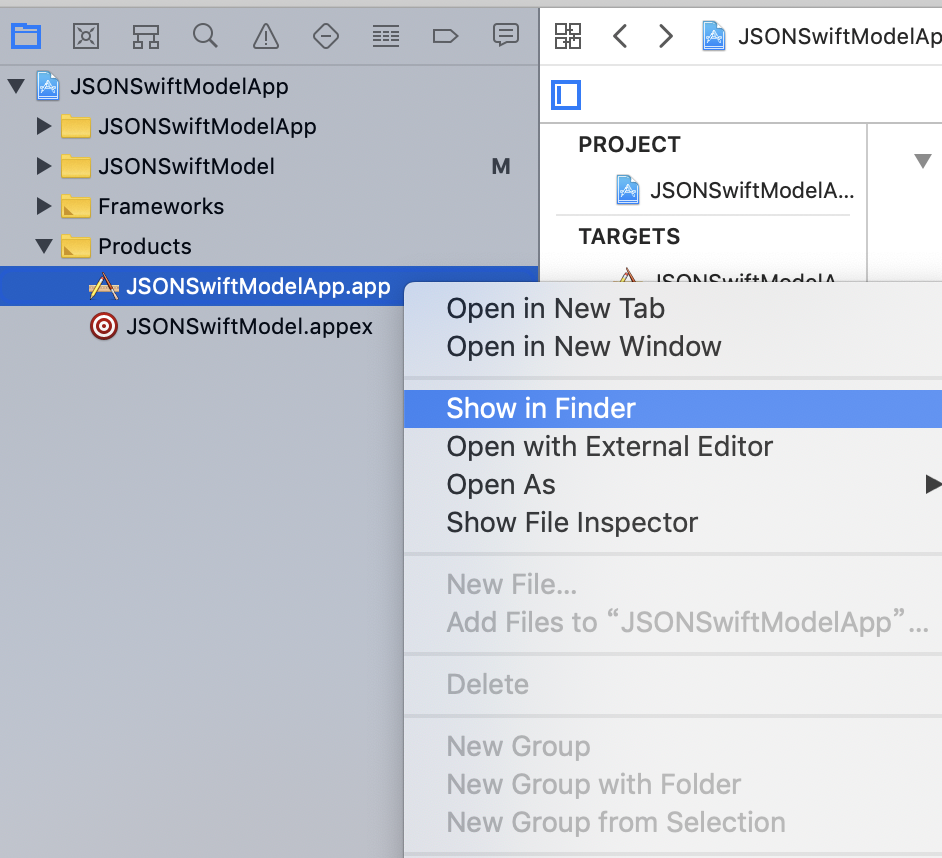
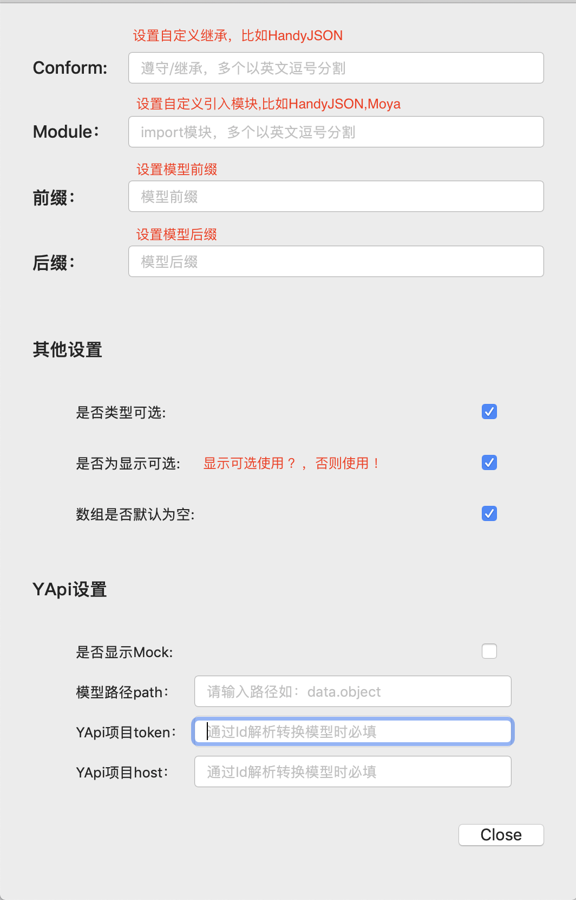
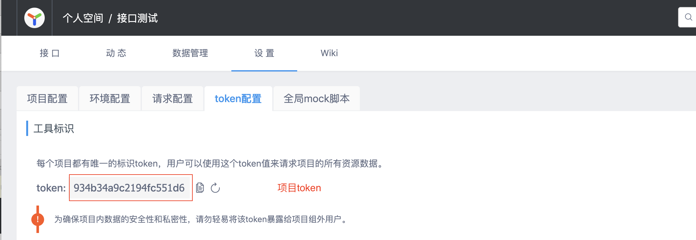
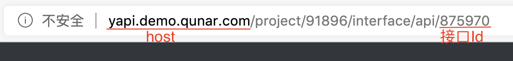
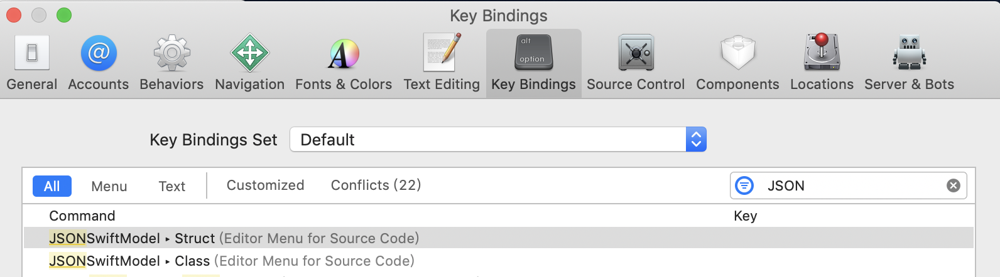
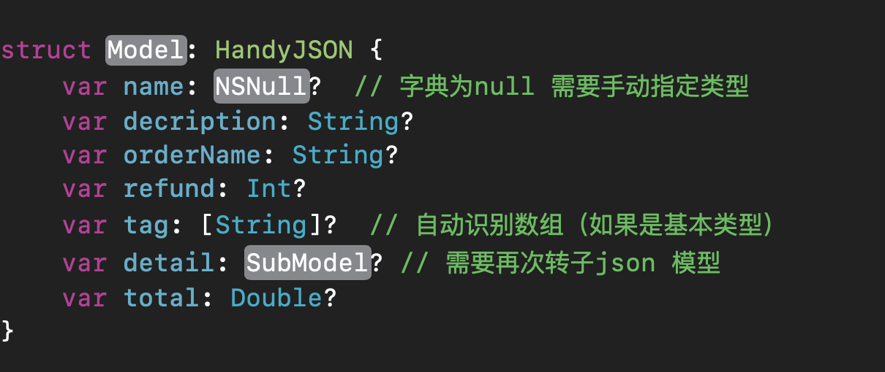
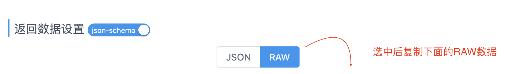

SwiftJSONModeler是一个Xcode插件，可以将json 转为Swfit模型
* 支持struct, class 
* 支持单json转模
* 支持YApi RAW或接口id解析转模，并且自动添加注释
* 支持自定义遵循 和 import
* 支持自定义模型前缀和后缀
* 可设置是否类型可选，是否使用显示可选`?`(不使用则为隐式可选`!`)
* YApi RWA支持按照路径解析模型，自动解析子类型

## 效果图

### 标准json 解析

复制单json, 一步转为模型。


如果无法预览查看[传输门](https://github.com/yumengqing/SwiftJSONModeler/blob/master/Sources/example.gif)或者[Sources/example.gif](./Sources/example.gif)

### YApi RAW解析

复制YApi接口RAW数据，一步解析带有注释的模型。
解析效果如下()：


如果无法预览查看[Source/YApiRAW.gif](./Sources/YApiRAW.gif)

## 安装
1.你可以选择[Release](https://github.com/yumengqing/SwiftJSONModeler/releases) 直接下载应用安装

2.你也可以选择下载源代码编译为应用
下载项目工程，修改为自己的bundleId

运行主项目SwiftJSONModeler For Xcode

再运行SwiftJSONModeler

确保没有报错的情况下，选择Products下的运行主项目SwiftJSONModeler For Xcode.app点击右键， 选择show in finder如下图



再将应用移动到应用程序, 重启Xcode即可使用。

> Tip:如果重启Xcode之后在Editor中还没看见插件选项，请选择系统设置-> 扩展->Xcode Source Editor中对应插件是否导入

## 设置
SwiftJSONModeler提供多种自定义可选设置，可通过插件的Config选项进行设置。

设置选项如下图：



**YApi模型路径指定**：当对象含有多层json,或者有基本json包裹时，可以指定path解析模型。

**YApi项目token**： 每个YApi项目都有唯一一个token,在YApi项目接口的设置中可以查看对应的token,如下图：



**YApi项目host**：host就是部署YApi的地址



## 设置快捷键

可以给插件设置快捷键，快速转换模型

在Xcode -> Preference -> Key Bindings -> Editor Menu For Source Code【或者搜索】就可以找到，如下图



记得双击key下面那个区域才可以编辑，这里我使用的是alt + s 和alt + c 避免与系统的冲突
## 标准JSON转模

复制需要转换的json,选择插件的Struct JSON或者Class JSON功能，即可生成相应Swift模型。
注意：目前只支持单层json

示例json

```javascript
{
  "orderName": "擦护理洗车",
  "decription": "退还到原支付账户",
  "refund": 58,
  "total": 18.2,
  "name": null,
  "detail": {
    "id": 1387329,
    "date": "2018-08-08"
  },
  "tag": [
    "美容洗车",
    "活动",
    "护理"
  ]
}
```

转模结果

```swift
struct <#Model#>: HandyJSON {
    var name: <#NSNull#>?  // 字典为null 需要手动指定类型
    var decription: String?
    var orderName: String?
    var refund: Int?
    var tag: [String]?  // 自动识别数组（如果是基本类型）
    var detail: <#SubModel#>? // 需要再次转子json 模型
    var total: Double?
}
```



## YApi 接口平台转模

如果你使用YApi接口平台，可以通过复制接口返回的 RAW数据，或者复制Id，自动转为模型，并且自动根据YApi为模型添加注释。

### 通过Id转模

在配置了项目token和host基础下,简单复制Id即可实现转模和添加注释.

**如何查看YApi接口中的id？**在YApi对应的接口中，查看浏览器网址，最后的数字就是Id。如下图：


### RAW数据

**RAW数据**：即YApi接口平台提供的带有接口字段及注释的json数据，查看方式：选择接口 -> 编辑 -> 返回数据设置 -> RAW 如下图



示例RAW数据：

```javascript
{"type":"object","title":"empty object","properties":{"message":{"type":"string"},"code":{"type":"string"},"response":{"type":"object","properties":{"teachers":{"type":"array","items":{"type":"object","properties":{"name":{"type":"string","mock":{"mock":"Mrs Yang"},"description":"名字"},"subject":{"type":"string","mock":{"mock":"语文"},"description":"科目"},"phone":{"type":"string","mock":{"mock":"13459923098"},"description":"联系电话"}},"required":["name","subject","phone"]},"description":"老师"},"name":{"type":"string","description":"姓名"},"age":{"type":"integer","mock":{"mock":"18"},"description":"年龄"},"score":{"type":"number","mock":{"mock":"89.8"},"description":"综合成绩"},"likes":{"type":"array","items":{"type":"string","mock":{"mock":"英雄联盟"}},"description":"爱好"},"emergercyContact":{"type":"object","properties":{"name":{"type":"string"},"phone":{"type":"string","description":"联系电话"},"address":{"type":"string","description":"联系地址","mock":{"mock":"xx街道xx栋xx单元"}}},"description":"紧急联系人","required":["name","phone","address"]},"isBoy":{"type":"boolean","description":"是否为男孩"}},"required":["teachers","name","age","score","likes","emergercyContact","isBoy"]}},"required":["message","code","response"]}
```

> 完整示例可下载打开SwiftJSONModelerDemo查看

### 解析指定路径模型

如果你数据有多层json, 可以在设置中指定解析路线path来获取指定模型。比如我的目标数据在response字段下，则可以配置path为response.则直接解析response下的json模型。多路径使用 `.`

 

## 待优化

* 直接解析出子json 或者 数组内子json
