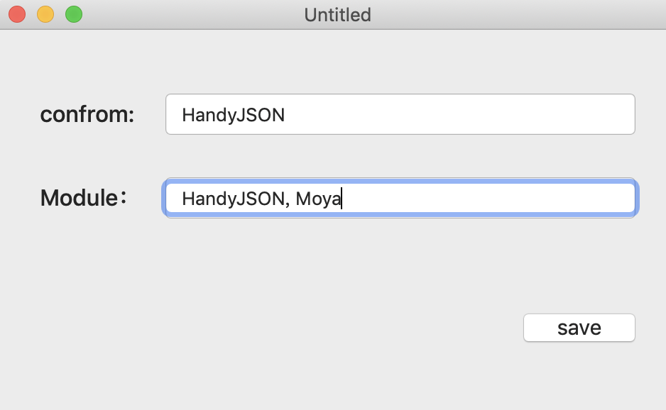

SwiftJSONModeler是一个Xcode插件，可以将json 转为模型
* 支持struct, class 
* 所有值为可选
* 支持自定义遵循 和 import 

## 效果图


如果无法预览查看Sources/example.gif
## 安装
1.你可以选择[Release](https://github.com/yumengqing/SwiftJSONModeler/releases) 直接下载应用安装
2.你也可以选择下载源代码编译为应用
下载项目工程，修改为自己的bundleId

运行主项目SwiftJSONModeler For Xcode

再运行SwiftJSONModeler

确保没有报错的情况下，选择Products下的运行主项目SwiftJSONModeler For Xcode.app点击右键， 选择show in finder如下图


再将应用移动到应用程序, 重启Xcode即可使用。

> Tip:如果重启Xcode之后在Editor中还没看见插件选项，请选择系统设置-> 扩展->Xcode Source Editor中对应插件是否导入

### 设置快捷键

可以给插件设置快捷键，快速转换模型

在Xcode -> Preference -> Key Bindings -> Editor Menu For Source Code【或者搜索】就可以找到，如下图


记得双击key下面那个区域才可以编辑，这里我使用的是alt + s 和alt + c 避免与系统的冲突

### 自定义操作confrom 和import

可以通过点击应用或者选择扩展的config选项，自定义填写import模块和继承

比如我需要继承HandyJSON




## 使用

使用的使用，首先要选中需要转换的json,注意不标准的json会报错的哟。仅限单层json，多层json子json需要单独转换

示例json

```javascript
{
  "orderName": "擦护理洗车",
  "decription": "退还到原支付账户",
  "refund": 58,
  "total": 18.2,
  "name": null,
  "detail": {
    "id": 1387329,
    "date": "2018-08-08"
  },
  "tag": [
    "美容洗车",
    "活动",
    "护理"
  ]
}
```

转模结果

```swift
struct <#Model#>: HandyJSON {
    var name: <#NSNull#>?  // 字典为null 需要手动指定类型
    var decription: String?
    var orderName: String?
    var refund: Int?
    var tag: [String]?  // 自动识别数组（如果是基本类型）
    var detail: <#SubModel#>? // 需要再次转子json 模型
    var total: Double?
}
```


## 待优化
* 直接解析出子json 或者 数组内子json
